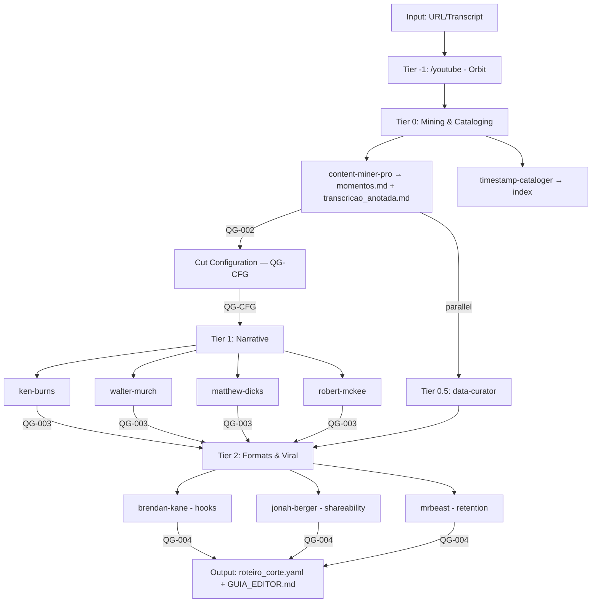

# 🎬 Curator Squad

> Content curation squad for mining, structuring, and formatting video content.

**IMPORTANT:** This squad ASSEMBLES existing content. It NEVER invents text.
For creating new text, use the `@copy` squad.

---

## Quick Start

```bash
# Activate the squad
/curator

# Or directly call the orchestrator
@curator:curator-chief

# Full pipeline: URL → Cut Script
*full-pipeline https://youtube.com/watch?v=xxx shorts
```

---

## What This Squad Does

1. **Mines** transcripts for high-value moments with EXACT timestamps
2. **Scores** moments via MQR rubric (Hook, Emotion, Shareability, Clarity)
3. **Structures** narrative using documentary methods (Ken Burns, Murch, Dicks, McKee)
4. **Configures** cuts with Duration Intelligence (content-driven, not fixed buckets)
5. **Formats** for specific platforms (shorts, longform, longform-simple)
6. **Enriches** with real news/data (optional)
7. **Delivers** editor-ready cut scripts + GUIA_EDITOR

---

## Agents (11)

### Orchestrator
| Agent | Command | Purpose |
|-------|---------|---------|
| curator-chief | `@curator:curator-chief` | Routes requests, coordinates tiers |

### Tier 0 - Mining & Cataloging
| Agent | Command | Purpose |
|-------|---------|---------|
| content-miner-pro | `@curator:content-miner-pro` | Extract moments with exact timestamps |
| timestamp-cataloger | `@curator:timestamp-cataloger` | Create searchable timestamp index |

### Tier 0.5 - Data Curation (Parallel)
| Agent | Command | Purpose |
|-------|---------|---------|
| data-curator | `@curator:data-curator` | Find real news/trends/data |

### Tier 1 - Narrative
| Agent | Command | Framework |
|-------|---------|-----------|
| ken-burns | `@curator:ken-burns` | Blind Assembly Method |
| walter-murch | `@curator:walter-murch` | Rule of Six |
| matthew-dicks | `@curator:matthew-dicks` | 5-Second Moment |
| robert-mckee | `@curator:robert-mckee` | Story Structure (scene analysis, value charges, the Gap) |

### Tier 2 - Formats & Viral
| Agent | Command | Framework |
|-------|---------|-----------|
| brendan-kane | `@curator:brendan-kane` | Hook Point (160+ templates) |
| jonah-berger | `@curator:jonah-berger` | STEPPS |
| mrbeast | `@curator:mrbeast` | Retention Architecture (minute-by-minute, zero dead time) |
| ffmpeg-cutter | `@curator:ffmpeg-cutter` | Tier 2 Specialist — executes video cuts via FFmpeg |

---

## Pipeline Flow



```
[Input: URL/Transcript]
        ↓
┌───────────────────────────────────┐
│ Tier -1: /youtube (Orbit)         │ ← External dependency
│ Fetch transcript if URL provided  │
└───────────────────────────────────┘
        ↓
┌───────────────────────────────────┐
│ Tier 0: Mining & Cataloging       │
│ content-miner-pro → momentos.md   │
│   + transcricao_anotada.md        │
│ timestamp-cataloger → index       │
│ MQR scoring (H/E/S/C)            │
└───────────────────────────────────┘
        ↓ QG-002
┌───────────────────────────────────┐
│ Cut Configuration (QG-CFG)        │
│ Duration Intelligence + Style     │
│ Multi-variant config              │
└───────────────────────────────────┘
        ↓                    ↓ (parallel if enrich=true)
┌─────────────────────┐  ┌──────────────────────┐
│ Tier 1: Narrative   │  │ Tier 0.5: Curation   │
│ ken-burns           │  │ data-curator         │
│ walter-murch        │  │ → curadoria.yaml     │
│ matthew-dicks       │  └──────────────────────┘
│ robert-mckee        │           │
│ → narrative_struct  │           │
└─────────────────────┘           │
        ↓ QG-003                  │
┌─────────────────────────────────┘
│ Tier 2: Formats & Viral          │
│ brendan-kane (hooks)             │
│ jonah-berger (shareability)      │
│ mrbeast (retention architecture) │
└──────────────────────────────────┘
        ↓ QG-004
[Output: roteiro_corte.yaml + GUIA_EDITOR.md]
```

---

## Workflows

| Workflow | Command | Description |
|----------|---------|-------------|
| wf-mine-to-cut | `*full-pipeline {url} {format}` | Complete pipeline (any format) |
| wf-shorts-pipeline | `*shorts {input} {platform}` | Optimized for <60s content |
| wf-longform-pipeline | `*longform {input} {style}` | Optimized for 10+ min content |
| wf-longform-simple-pipeline | `*longform-simple {input}` | Conversation-based longform (20-25 min, minimal restructuring) |
| wf-multi-format | `*multi-format {input}` | Mine once, format many (parallel) |

---

## Output Locations

### Mining Output (Tier 0)
| Output | Path | Description |
|--------|------|-------------|
| **Deliverable** | `output/curated/{source-slug}/momentos.md` | Top 50 moments — compact MD, human-scannable |
| **Archive** | `_temp/mining/{source-slug}/all_moments_merged.md` | ALL moments (reference only) |
| **Parts** | `_temp/mining/{source-slug}/parts/` | Sub-agent raw outputs (audit trail) |

### Annotated Transcript (Tier 0)
| Output | Path | Description |
|--------|------|-------------|
| **Annotated** | `output/curated/{source-slug}/transcricao_anotada.md` | Full transcript with KEEP/REMOVE/BRIDGE markers |

### Pipeline Output (Tier 2)
| Output | Path | Description |
|--------|------|-------------|
| **Longform Cut** | `output/curated/{source-slug}/cortes/longform/{NN}_{titulo}.yaml` | Cut script + assembly order |
| **Shorts Cut** | `output/curated/{source-slug}/cortes/shorts/{NN}_{titulo}.yaml` | Short-form cut script |
| **Editor Guide** | `output/curated/{source-slug}/cortes/longform/{NN}_{titulo}_GUIA_EDITOR.md` | Human-readable editing instructions |

### Cut Script Format
```yaml
momentos:
  - id: 1
    timestamp_inicio: "00:12:34"
    timestamp_fim: "00:13:45"
    transcricao: |
      Tudo que te ensinaram sobre produtividade está errado...
    tipo: "hook"
    ordem_montagem: 1
    notas_editor: "Hook de abertura, não adicionar intro antes"
```

---

## Key Principles

### 1. ZERO INVENTION
This squad MOUNTS existing content. It NEVER creates new text.
For new text → use `@copy` squad.

### 2. EXACT TIMESTAMPS
All timestamps must be exact: `00:12:34` not "around 12 minutes".
Editor must be able to cut directly to these points.

### 3. NARRATIVE COHERENCE
Output must make sense from start to finish.
Not choppy or random. May need transition phrases.

### 4. REAL DATA ONLY
Data curation = real news/trends/statistics with sources.
NEVER invented data.

---

## Frameworks Reference

### Tier 0 - Mining

| Framework | Agent | Key Concept |
|-----------|-------|-------------|
| ATHENA-MEK | content-miner-pro | 3-pass mining: Anchor → Extract → Audit. Anti-laziness, territorial coverage |
| MQR (Moment Quality Rubric) | content-miner-pro | 4-dimension scoring: Hook (H), Emotion (E), Shareability (S), Clarity (C) |

### Tier 1 - Narrative

| Framework | Agent | Key Concept |
|-----------|-------|-------------|
| Blind Assembly | ken-burns | Audio first, test without visual |
| Rule of Six | walter-murch | Emotion (51%) > Story > Rhythm > ... |
| 5-Second Moment | matthew-dicks | Find THE moment of transformation |
| Story Structure | robert-mckee | Scene analysis, value charges, the Gap |

### Tier 2 - Viral

| Framework | Agent | Key Concept |
|-----------|-------|-------------|
| Hook Point | brendan-kane | 3-second capture, 160+ templates |
| STEPPS | jonah-berger | Social Currency, Triggers, Emotion, Public, Practical, Stories |
| Retention Architecture | mrbeast | Minute-by-minute pacing, zero dead time |

### Cross-Tier - Cut Configuration

| Feature | Description |
|---------|-------------|
| Duration Intelligence | Content-driven duration (not fixed 15/30/60 buckets). Completion rate > absolute length |
| Style Presets | viral, educational, emotional, entertaining, conversational — each with measurable pacing params |
| Multi-Variant | Up to 5 variants per source, each with unique hook. Diversity enforced |

---

## Quality Gates

| Gate | Transition | Type | Key Criteria |
|------|-----------|------|-------------|
| QG-001 | External → Tier 0 | Blocking | Transcript exists, readable, duration known |
| QG-002 | Tier 0 → Config | Blocking | momentos.md + transcricao_anotada.md exist, MQR scored, ATHENA checks pass |
| QG-CFG | Config → Tier 1 | Blocking | Duration Intelligence calculated, style preset selected, user confirmed |
| QG-003 | Tier 1 → Tier 2 | Blocking | Assembly order valid, no narrative gaps, transitions identified |
| QG-004 | Tier 2 → Delivery | Blocking | roteiro_corte.yaml complete, all timestamps exact, editor instructions clear |

---

## Deprecation Notice

⚠️ **`/content-miner` (Orion) is DEPRECATED**

The old `/content-miner` agent is replaced by `@curator:content-miner-pro`.

| Old | New |
|-----|-----|
| `/content-miner` | `@curator:content-miner-pro` |
| Approximate timestamps | EXACT timestamps |
| Generic extraction | Paper Edit methodology |
| insights.yaml | {source-slug}/momentos.md |

The old agent will be removed after this squad is validated.

---

## External Dependencies

| Dependency | Purpose | When Used |
|------------|---------|-----------|
| `/youtube` (Orbit) | Fetch transcripts from YouTube | When URL provided instead of transcript |

---

## Installation

The squad is ready to use once the structure exists at `squads/curator/`.

To register commands:
```bash
# The curator-chief handles routing
# Individual agents can be called directly
@curator:{agent-id}
```

---

## Files

```
squads/curator/
├── config.yaml                    # Squad configuration
├── README.md                      # This file
├── agents/
│   ├── curator-chief.md           # Orchestrator
│   ├── content-miner-pro.md       # Tier 0 - Mining
│   ├── timestamp-cataloger.md     # Tier 0 - Cataloging
│   ├── data-curator.md            # Tier 0.5 - Data curation
│   ├── ken-burns.md               # Tier 1 - Blind Assembly
│   ├── walter-murch.md            # Tier 1 - Rule of Six
│   ├── matthew-dicks.md           # Tier 1 - 5-Second Moment
│   ├── robert-mckee.md            # Tier 1 - Story Structure
│   ├── brendan-kane.md            # Tier 2 - Hook Point
│   ├── jonah-berger.md            # Tier 2 - STEPPS
│   └── mrbeast.md                 # Tier 2 - Retention Architecture
├── workflows/
│   ├── wf-mine-to-cut.yaml              # Main pipeline (any format)
│   ├── wf-shorts-pipeline.yaml          # Shorts (<60s)
│   ├── wf-longform-pipeline.yaml        # Longform (10+min)
│   ├── wf-longform-simple-pipeline.yaml # Longform simple (20-25min, conversation)
│   └── wf-multi-format.yaml             # Multi-format (parallel)
├── templates/
│   ├── banco-momentos-tmpl.md           # Compact mining output (v3.0)
│   ├── transcricao-anotada-tmpl.md      # Annotated transcript (KEEP/REMOVE/BRIDGE)
│   ├── curadoria-tmpl.yaml              # Data curation template
│   ├── narrative-structure-tmpl.yaml    # Narrative arc structure (Tier 1)
│   ├── longform-cut-tmpl.yaml          # Longform cut (10+ min)
│   ├── longform-simple-cut-tmpl.yaml   # Longform simple cut (conversational)
│   ├── shorts-cut-tmpl.yaml            # Shorts cut (5-beat, <60s)
│   ├── roteiro-corte-tmpl.yaml         # Generic cut script (legacy fallback, use format-specific templates)
│   └── social-clips-tmpl.yaml          # Social clips (STEPPS-scored)
├── checklists/
│   ├── mining-quality.md          # QG-002 validation (v2.5, 65 items, tiered)
│   ├── narrative-quality.md       # QG-003 validation
│   ├── output-quality.md          # QG-004 validation
│   ├── curation-quality.md        # QG-CUR validation
│   └── security-validation.md     # Security & compliance (v3.2.0) ← NEW
├── tasks/
│   ├── mine-transcript.md         # ATHENA-MEK mining (v3.0, 7 passes + MQR)
│   ├── build-narrative.md         # Narrative assembly
│   ├── format-cut.md              # Format optimization + Duration Intelligence
│   ├── generate-editor-guide.md   # GUIA_EDITOR generation
│   ├── curate-data.md             # Data curation
│   ├── catalog-transcript.md      # Timestamp cataloging (hybrid worker+agent)
│   ├── resume-mining.md           # Resume interrupted mining (v3.2.0) ← NEW
│   └── validate-curation.md       # Standalone validation (v3.2.0) ← NEW
├── data/
│   ├── moment-types.yaml          # 6 moment types with detection signals
│   ├── viral-triggers.yaml        # 7 ATHENA viral triggers (psychological)
│   ├── moment-quality-rubric.yaml # MQR: 4-dimension scoring (H/E/S/C)
│   ├── matthew-dicks-dna.yaml     # Matthew Dicks voice/thinking DNA
│   ├── stt-corrections.yaml       # Speech-to-text correction rules
│   └── tool-registry.yaml         # Tool/MCP/script catalog (v3.2.0) ← NEW
├── scripts/ (squad-specific)
│   └── execute_ffmpeg_cuts.py          # FFmpeg cut execution with dry-run and report generation
└── scripts/ (at project root)
    ├── generate_compact_mining.py      # Top-50 selection + compact MD
    ├── generate_annotated_transcript.py # Annotated transcript generation
    ├── generate_editor_guide.py        # GUIA_EDITOR generation
    ├── catalog_transcript.py           # Worker script for hybrid cataloging
    ├── validate_timestamps.py          # Timestamp validation (blocking)
    ├── validate_transcription.py       # Transcription drift detection
    └── _validation_common.py           # Shared parsing module
```

---

## v3.4.0 Changelog (2026-02-18)

**Cross-pollination upgrade** — best practices from ETL squad applied to Curator.

### New Files
| File | Type | Description |
|------|------|-------------|
| `tasks/resume-mining.md` | Task | Resume interrupted mining from checkpoint |
| `tasks/validate-curation.md` | Task | Standalone end-to-end validation |
| `checklists/security-validation.md` | Checklist | Security & compliance for data curation |
| `data/tool-registry.yaml` | Data | Catalog of all tools, scripts, MCPs |

### Upgraded Files
| File | Change |
|------|--------|
| `checklists/mining-quality.md` | Completeness tiering (Tier 1 blocking / Tier 2 important / Tier 3 advisory) |
| `agents/curator-chief.md` | +thinking_dna, +objection_algorithms (6 edge case handlers) |
| `agents/content-miner-pro.md` | +thinking_dna (ATHENA decision heuristics) |
| `agents/timestamp-cataloger.md` | +thinking_dna (cataloging pipeline decisions) |
| `agents/data-curator.md` | +thinking_dna (Dave Pell + anti-hallucination) |
| All 5 non-mine tasks | Standardized YAML frontmatter with typed inputs/outputs |

### Metrics
| Metric | v3.1 | v3.2 |
|--------|------|------|
| Tasks | 6 | 8 |
| Checklists | 4 | 5 |
| Data files | 5 | 6 |
| Agents with thinking_dna | 7/11 | 11/11 |
| Agents with objection_algorithms | 9/11 | 11/11 |

---

## Version

- **Squad Version:** 3.4.0
- **Created:** 2026-02-04
- **Updated:** 2026-02-18
- **Framework:** AIOS

---

## Related Squads

| Squad | Relationship |
|-------|--------------|
| `@copy` | Receives high-impact moments for repurposing into new copy |
| `@newsletter` | Receives insights for newsletter content |
| `/youtube` | External dependency for transcript acquisition |
