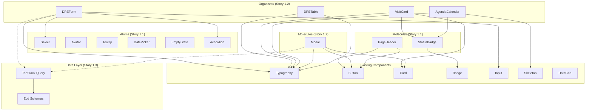
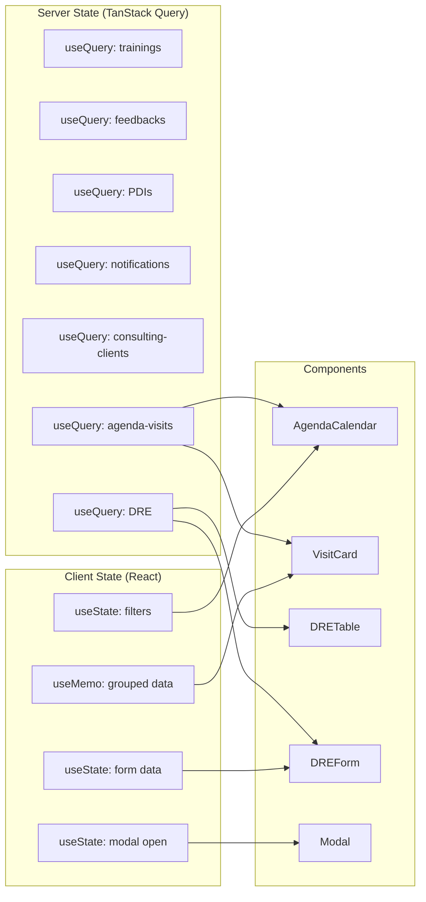

# MX Gestao Preditiva — Brownfield Enhancement Architecture

> Generated: 2026-04-15 | Architect: Aria | Phase: UI Analysis & Planning
> Epic: EPIC-UI-01 — Design System Completion & Architecture Hardening

---

## 1. Introduction

This document defines the architectural blueprint for **EPIC-UI-01: Design System Completion & Architecture Hardening** — a brownfield enhancement to MX Performance's frontend that addresses critical technical debt, completes the Atomic Design system, introduces server state management (TanStack Query), activates runtime validation (Zod), and extracts monolithic page components into reusable organisms.

### 1.1 Relationship to Existing Architecture

This document **supplements** the existing `docs/brownfield-architecture.md` (513 lines of analysis). It does not replace it. Where the brownfield-architecture.md describes the **current state**, this document prescribes the **target state and migration path**. All decisions are grounded in actual codebase analysis — every hook, component, token, and page has been read and accounted for.

### 1.2 Change Log

| Change | Date | Version | Description | Author |
|--------|------|---------|-------------|--------|
| Initial creation | 2026-04-15 | 1.0 | Architecture for EPIC-UI-01 (5 stories) | Aria |

---

## 2. Existing Project Analysis

### 2.1 Current Project State

- **Primary Purpose:** Role-based performance management platform for automotive retail networks (4 roles: admin, gerente, vendedor, dono) with consulting CRM, DRE financial analysis, scheduling, and gamification
- **Current Tech Stack:** React 19.0 + TypeScript 5.8.2 + Vite 6.2 + Tailwind CSS v4.1 (native) + Supabase 2.102 + react-router-dom 7.13 + Motion 12 + Recharts 3.7 + CVA 0.7 + Zod 4.3 (unused) + Sonner 2.0
- **Architecture Style:** Component-based SPA with Atomic Design (partially adopted), lazy-loaded routes, role-based rendering via `RoleSwitch`
- **Deployment Method:** Vercel (`vercel --prod`) with `vercel.json`, Bun as package manager

### 2.2 Available Documentation

- `docs/brownfield-architecture.md` — Comprehensive current-state analysis (513 lines)
- `docs/front-end-spec.md` — Frontend specification (14 component specs, 7 interaction patterns)
- `docs/prd.md` — Product requirements for EPIC-UI-01
- `docs/MAPEAMENTO-COMPLETO-MX-PERFORMANCE.md` — Full project mapping
- `docs/design-system/` — Build report, pattern library, a11y audit, ROI report
- `docs/architecture/system-architecture.md` — System-level architecture
- `docs/stories/` — Individual story specifications

### 2.3 Identified Constraints

1. **Zero-downtime requirement** — Enhancement must be deployed incrementally; no big-bang refactor
2. **Portuguese-first UI** — All new components must use Brazilian Portuguese for labels/empty states
3. **Tailwind v4 native** — No `tailwind.config.js`; tokens defined in `@theme` blocks in `index.css`
4. **Supabase direct** — No ORM; all queries via `supabase.from().select()` pattern
5. **Lazy-loading mandate** — All pages must remain lazy-loaded via `React.lazy()`
6. **Role-based access** — New components must respect 4-role `RoleSwitch` pattern
7. **CVA pattern** — All variant styling must use `class-variance-authority` consistently
8. **`@` path alias** — All imports use `@/` prefix (configured in `vite.config.ts`)

---

## 3. Enhancement Scope and Integration Strategy

### 3.1 Enhancement Overview

**Enhancement Type:** Architectural refactoring + design system completion
**Scope:** 5 stories covering atom/molecule creation, organism extraction, TanStack Query migration, Zod activation, and page integration
**Integration Impact:** Medium — touches hooks layer, component layer, and page layer without changing routes or database schema

### 3.2 Integration Approach

**Code Integration Strategy:** Incremental additive — new components are created alongside existing ones, pages are refactored one at a time to consume them, with each story independently deployable

**Database Integration:** No schema changes. TanStack Query wraps existing Supabase queries. Zod validates response shapes at hook boundaries.

**API Integration:** No new APIs. All data continues to flow through `supabase.from()` queries wrapped in TanStack Query query functions.

**UI Integration:** New organisms extracted from existing page code consume existing atoms/molecules (Typography, Button, Card, Badge, Input, Skeleton). Modal molecule wraps `@radix-ui/react-dialog` already in `package.json`.

### 3.3 Compatibility Requirements

- **Existing API Compatibility:** 100% — no Supabase query changes, only query orchestration layer
- **Database Schema Compatibility:** 100% — no migrations, no new tables
- **UI/UX Consistency:** All new components use existing `mx-*` design tokens, `cn()` utility, CVA variants
- **Performance Impact:** Positive — TanStack Query adds caching, deduplication, and stale-while-revalidate. Initial bundle increase ~15KB (gzipped) for `@tanstack/react-query`.

---

## 4. Tech Stack Alignment

### 4.1 Existing Technology Stack

| Category | Technology | Version | Usage in Enhancement | Notes |
|----------|-----------|---------|---------------------|-------|
| Framework | React | 19.0 | Unchanged | Used for all components |
| Language | TypeScript | 5.8.2 | Unchanged | Strict mode for new code |
| Build | Vite | 6.2+ | Add TanStack Query to vendor chunks | `vite.config.ts:19-26` |
| Styling | Tailwind CSS | 4.1+ | Unchanged | `@theme` tokens in `index.css` |
| Routing | react-router-dom | 7.13+ | Unchanged | Lazy loading preserved |
| Animation | Motion | 12.x | Unchanged | `AnimatePresence` in organisms |
| Variants | CVA | 0.7+ | Used in all new atoms/molecules | Consistent with Button/Badge patterns |
| Dialog | @radix-ui/react-dialog | 1.1+ | Wraps Modal molecule | Already in `package.json` |
| Validation | Zod | 4.3+ | Activated for runtime schemas | Currently unused dependency |
| Icons | Lucide React | 0.575+ | Unchanged | |
| Toast | Sonner | 2.0+ | Unchanged | |
| Charts | Recharts | 3.7+ | Unchanged | |
| Testing | Bun test + Testing Library | — | New test files per component | `bun test` in `package.json:17` |
| E2E | Playwright | 1.58+ | Integration tests for organisms | `test:e2e` in `package.json:18` |

### 4.2 New Technology Additions

| Technology | Version | Purpose | Rationale | Integration Method |
|-----------|---------|---------|-----------|-------------------|
| `@tanstack/react-query` | ^5.x | Server state management (caching, deduplication, background refetch, optimistic updates) | Replaces 22 manual `useState+useEffect+useCallback` hooks (TD-01); proven in brownfield React apps; minimal API surface | `npm install @tanstack/react-query`; `QueryClientProvider` in `App.tsx` |
| `@tanstack/react-query-devtools` | ^5.x | Dev-time query inspector | Debug aid for migration; tree-shaken in production | Conditional import in `App.tsx` |

**No other new dependencies.** Zod is already present. Radix Dialog is already present. Everything else exists.

---

## 5. Component Architecture

### 5.1 Atomic Design Layer Definitions

Based on analysis of existing components (`src/components/`), the following layer boundaries are formalized:

**Atoms** — Single-responsibility primitives with CVA variants, no business logic, no Supabase calls:
| Atom | Story | Source Pattern | Notes |
|------|-------|---------------|-------|
| Select | 1.1 | Raw `<select>` in `AgendaAdmin.tsx:649-657`, `DREView.tsx:406-410` | CVA-styled, consistent with Input atom |
| Avatar | 1.1 | Inline avatar in `Layout.tsx` header | Image/initial fallback, size variants |
| Tooltip | 1.1 | CSS `group-hover` patterns | Accessible via `aria-describedby` |
| DatePicker | 1.1 | Native `<input type="date/time">` in AgendaAdmin, DREView | Wraps native date input with MX styling |
| EmptyState | 1.1 | Ad-hoc in `DataGrid.tsx:51-59`, `AgendaAdmin.tsx:427-435`, `DREView.tsx:234-239` | Icon + message + optional CTA |
| Accordion | 1.1 | Inline collapsible sections in `DREView.tsx:418-455` | Collapsible sections with header toggle |

**Molecules** — Composed from 2+ atoms, may contain display logic, no Supabase calls:
| Molecule | Story | Source Pattern | Notes |
|----------|-------|---------------|-------|
| PageHeader | 1.1 | Repeated across all 39 pages: title bar + subtitle + action buttons | Extract from `AgendaAdmin.tsx:230-272` pattern |
| Modal | 1.2 | Raw div overlay in `AgendaAdmin.tsx:628-765`, `DREView.tsx:394-495` | Wraps `@radix-ui/react-dialog` with `useFocusTrap` |
| StatusBadge | 1.2 | `getVisitStatusBadge()` in `AgendaAdmin.tsx:47-55` | Status-to-variant mapping with dot indicator |

**Organisms** — Complex composed components with internal state, may consume hooks:
| Organism | Story | Source Pattern | LOC Saved |
|----------|-------|---------------|-----------|
| AgendaCalendar | 1.2 | `AgendaAdmin.tsx:332-412` (80 LOC) — month grid, day cells, visit dots | ~80 LOC |
| VisitCard | 1.2 | `AgendaAdmin.tsx:460-547` (87 LOC) — visit row with status, actions, link | ~87 LOC |
| DRETable | 1.2 | `DREView.tsx:312-392` (80 LOC) — annual 12-month DRE table | ~80 LOC |
| DREForm | 1.2 | `DREView.tsx:394-495` (101 LOC) — modal form with 6 sections | ~101 LOC |

### 5.2 Component Interaction Diagram



### 5.3 File Organization

New files to be added (existing structure unchanged):

```
src/
├── components/
│   ├── atoms/
│   │   ├── Select.tsx              # Story 1.1
│   │   ├── Select.test.ts          # Story 1.1
│   │   ├── Avatar.tsx              # Story 1.1
│   │   ├── Avatar.test.ts          # Story 1.1
│   │   ├── Tooltip.tsx             # Story 1.1
│   │   ├── DatePicker.tsx          # Story 1.1
│   │   ├── EmptyState.tsx          # Story 1.1
│   │   ├── EmptyState.test.ts      # Story 1.1
│   │   └── Accordion.tsx           # Story 1.1
│   ├── molecules/
│   │   ├── PageHeader.tsx          # Story 1.1
│   │   ├── PageHeader.test.ts      # Story 1.1
│   │   ├── Modal.tsx               # Story 1.2
│   │   ├── Modal.test.ts           # Story 1.2
│   │   └── StatusBadge.tsx         # Story 1.2
│   └── organisms/
│       ├── AgendaCalendar.tsx      # Story 1.2
│       ├── AgendaCalendar.test.ts  # Story 1.2
│       ├── VisitCard.tsx           # Story 1.2
│       ├── VisitCard.test.ts       # Story 1.2
│       ├── DRETable.tsx            # Story 1.2
│       ├── DREForm.tsx             # Story 1.2
│       └── DataGrid.tsx            # EXISTING — unchanged
├── hooks/
│   ├── useData.ts                  # DEPRECATED across stories, split into:
│   ├── useTrainings.ts             # Story 1.3 (extracted from useData.ts:9-54)
│   ├── useFeedbacks.ts             # Story 1.3 (extracted from useData.ts:57-134)
│   ├── usePDIs.ts                  # Story 1.3 (extracted from useData.ts:136-252)
│   ├── useFeedbackReports.ts       # Story 1.3 (extracted from useData.ts:153-176)
│   ├── useNotifications.ts         # Story 1.3 (extracted from useData.ts:255-338)
│   ├── useBroadcasts.ts            # Story 1.3 (extracted from useData.ts:341-373)
│   ├── useTeamTrainings.ts         # Story 1.3 (extracted from useData.ts:376-425)
│   └── useDeliveryRules.ts         # Story 1.3 (extracted from useData.ts:428-458)
├── lib/
│   ├── supabase.ts                 # UNCHANGED
│   ├── queryClient.ts              # Story 1.3 (TanStack Query client setup)
│   └── schemas/                    # Story 1.4
│       ├── training.schema.ts      # Zod schema for Training + TrainingProgress
│       ├── feedback.schema.ts      # Zod schema for Feedback + FeedbackFormData
│       ├── pdi.schema.ts           # Zod schema for PDI + PDIReview
│       ├── notification.schema.ts  # Zod schema for Notification
│       ├── consulting-client.schema.ts # Zod schema for ConsultingClient + detail
│       ├── dre.schema.ts           # Zod schema for DREFinancial
│       └── index.ts                # Re-exports
└── App.tsx                         # MODIFY: add QueryClientProvider wrapper
```

### 5.4 Integration Guidelines

- **File Naming:** PascalCase for components (matching existing `Button.tsx`, `Card.tsx`), camelCase for hooks (matching existing `useData.ts`, `useDRE.ts`), camelCase for schemas
- **Folder Organization:** New atoms/molecules/organisms in existing `src/components/` hierarchy; new schemas in `src/lib/schemas/`; domain hooks replace `useData.ts` contents
- **Import/Export Patterns:** Named exports (matching existing pattern: `export function useTrainings()`, `export const DataGrid = memo(...)`); barrel re-exports from `lib/schemas/index.ts`

---

## 6. Data Layer Architecture

### 6.1 TanStack Query Setup

**Provider Installation** — `App.tsx` modification (Story 1.3):

```tsx
import { QueryClient, QueryClientProvider } from '@tanstack/react-query'

const queryClient = new QueryClient({
  defaultOptions: {
    queries: {
      staleTime: 5 * 60 * 1000,     // 5 minutes
      gcTime: 10 * 60 * 1000,        // 10 minutes (formerly cacheTime)
      retry: 2,
      refetchOnWindowFocus: false,
    },
  },
})
```

Wrapping hierarchy: `QueryClientProvider` → `AuthProvider` → `ErrorBoundary` → `Router`

**Vite Chunk Update** — `vite.config.ts:19-26`:

```ts
'vendor-query': ['@tanstack/react-query'],
```

### 6.2 Hook Decomposition Plan (TD-04, TD-07)

**Current State:** `useData.ts` (458 LOC) contains 7 unrelated hooks. Each follows the identical `useState+useCallback+useEffect` pattern.

**Target State:** One file per domain hook, each using TanStack Query's `useQuery`/`useMutation`.

| Hook | Current Location | Target File | Query Key Pattern | Migration Complexity |
|------|-----------------|-------------|-------------------|---------------------|
| `useTrainings` | `useData.ts:9-54` | `hooks/useTrainings.ts` | `['trainings', role]` | Low |
| `useFeedbacks` | `useData.ts:57-134` | `hooks/useFeedbacks.ts` | `['feedbacks', storeId, filters]` | Medium (role-based query builder) |
| `useMyPDIs` | `useData.ts:136-151` | Merged into `usePDIs` | `['pdis', profileId]` | Low |
| `useWeeklyFeedbackReports` | `useData.ts:153-176` | `hooks/useFeedbackReports.ts` | `['feedback-reports', storeId]` | Low |
| `usePDIs` | `useData.ts:179-252` | `hooks/usePDIs.ts` | `['pdis', storeId, role]` | Medium (reviews sub-query) |
| `useNotifications` | `useData.ts:255-338` | `hooks/useNotifications.ts` | `['notifications', profileId]` | High (mutations + RPC) |
| `useSystemBroadcasts` | `useData.ts:341-373` | `hooks/useBroadcasts.ts` | `['broadcasts']` | Low |
| `useTeamTrainings` | `useData.ts:376-425` | `hooks/useTeamTrainings.ts` | `['team-trainings', storeId]` | High (3 parallel queries + computation) |
| `useStoreDeliveryRules` | `useData.ts:428-458` | `hooks/useDeliveryRules.ts` | `['delivery-rules', storeId]` | Low |

**Hook Migration Pattern** — Example (`useTrainings`):

```ts
// BEFORE (useData.ts:9-54) — manual pattern
export function useTrainings() {
  const { profile, role } = useAuth()
  const [trainings, setTrainings] = useState([])
  const [loading, setLoading] = useState(true)
  const [error, setError] = useState(null)
  const fetchTrainings = useCallback(async () => { /* ... */ }, [profile, role])
  useEffect(() => { fetchTrainings() }, [fetchTrainings])
  return { trainings, loading, error, refetch: fetchTrainings }
}

// AFTER (hooks/useTrainings.ts) — TanStack Query pattern
export function useTrainings() {
  const { profile, role } = useAuth()
  return useQuery({
    queryKey: ['trainings', role],
    queryFn: () => fetchTrainings(profile!.id, role!),
    enabled: !!profile,
  })
}

export function useMarkWatched() {
  const qc = useQueryClient()
  return useMutation({
    mutationFn: (trainingId: string) => markWatched(trainingId),
    onSuccess: () => qc.invalidateQueries({ queryKey: ['trainings'] }),
  })
}
```

**Existing domain hooks that remain unchanged:**

- `useDRE.ts` — Already well-structured (132 LOC), will be wrapped by TanStack Query in Story 1.3
- `useConsultingClients.ts` — Already well-structured (345 LOC), will be wrapped in Story 1.3
- `useAgendaAdmin.ts` — Already well-structured, will be wrapped in Story 1.3
- `useFocusTrap.ts` — Pure utility hook, no data fetching, unchanged
- `useAuth.tsx` — Context provider, wraps Supabase Auth — unchanged (not server state)

### 6.3 Zod Schema Boundaries (TD-02)

**Strategy:** Zod schemas validate data at **hook output boundaries** — after Supabase returns raw JSON, before components consume it. This catches API contract drift without changing Supabase queries.

| Schema | File | Validates | Used By |
|--------|------|-----------|---------|
| `TrainingSchema` | `lib/schemas/training.schema.ts` | `trainings` + `training_progress` rows | `useTrainings` |
| `FeedbackSchema` | `lib/schemas/feedback.schema.ts` | `feedbacks` rows + join aliases | `useFeedbacks` |
| `PDISchema` | `lib/schemas/pdi.schema.ts` | `pdis` + `pdi_reviews` rows | `usePDIs` |
| `NotificationSchema` | `lib/schemas/notification.schema.ts` | `notifications` rows | `useNotifications` |
| `ConsultingClientSchema` | `lib/schemas/consulting-client.schema.ts` | `consulting_clients` + detail aggregates | `useConsultingClients` |
| `DREFinancialSchema` | `lib/schemas/dre.schema.ts` | `consulting_financials` rows (~40 fields) | `useDRE` |

**Schema Pattern:**

```ts
import { z } from 'zod'

export const TrainingSchema = z.object({
  id: z.string().uuid(),
  title: z.string(),
  description: z.string().nullable(),
  type: z.string().nullable(),
  video_url: z.string().url().nullable(),
  target_audience: z.enum(['todos', 'vendedor', 'gerente', 'admin']),
  active: z.boolean(),
  created_at: z.string(),
})

export const TrainingArraySchema = z.array(TrainingSchema)

// In hook:
const result = TrainingArraySchema.safeParse(data)
if (!result.success) {
  console.error('[useTrainings] Schema validation failed:', result.error)
  throw new Error('Invalid training data from server')
}
return result.data
```

---

## 7. State Management Architecture

### 7.1 Server State vs Client State

**Server State** (TanStack Query — Story 1.3):
- All Supabase query results (trainings, feedbacks, PDIs, notifications, clients, visits, DRE, etc.)
- Managed via `useQuery` / `useMutation` with automatic cache, deduplication, and background refetch
- Query keys follow domain pattern: `['trainings', role]`, `['feedbacks', storeId, filters]`

**Client State** (React `useState` — unchanged):
- Form state (e.g., `scheduleForm` in `AgendaAdmin.tsx:95-104`)
- UI toggle state (e.g., modal open/close, collapsed sections)
- Filter selections (e.g., `dateFilter`, `statusFilter`)
- Computed derived state (e.g., `groupedVisits` via `useMemo`)

### 7.2 State Flow Diagram



### 7.3 Mutation & Cache Invalidation Strategy

All mutations use TanStack Query's `useMutation` with `onSuccess` invalidation:

```ts
export function useCreateVisit() {
  const qc = useQueryClient()
  return useMutation({
    mutationFn: (input: CreateVisitInput) => createVisitSupabase(input),
    onSuccess: () => {
      qc.invalidateQueries({ queryKey: ['agenda-visits'] })
    },
  })
}
```

This replaces the current pattern where each mutation manually calls `await fetchXxx()` to refresh data (seen in `useData.ts:41-43`, `useData.ts:123`, `useData.ts:226`, etc.).

---

## 8. Integration Points — Organism Extraction

### 8.1 Modal Standardization (TD-05, TD-06)

**Current State (2 inconsistent patterns):**

1. **AgendaAdmin.tsx:628-765** — Raw `div` overlay with `className="fixed inset-mx-0 bg-mx-black/60"`, no focus trap, no Radix
2. **DREView.tsx:394-495** — Raw `div` overlay with `useFocusTrap(modalRef, modalOpen)`, no Radix

**Target State — `<Modal>` molecule (Story 1.2):**

```tsx
interface ModalProps {
  open: boolean
  onClose: () => void
  title: string
  description?: string
  icon?: React.ReactNode
  children: React.ReactNode
  maxWidth?: string
}
```

Wraps `@radix-ui/react-dialog` (already in `package.json:26`) for:
- Proper `aria-modal`, `role="dialog"`, focus trap (built into Radix)
- Escape key handling (replaces manual `handleModalEscape` in `DREView.tsx:219`)
- Backdrop click to close (replaces manual `onClick={() => setOpen(false)}`)
- Consistent visual styling: `bg-mx-black/60 backdrop-blur-md` overlay + white `Card` content

### 8.2 AgendaAdmin Extraction (Story 1.2)

**Current:** `AgendaAdmin.tsx` — 768 LOC monolithic page

**Target decomposition:**

| Extracted Component | Lines | Responsibility |
|--------------------|-------|----------------|
| `<AgendaCalendar>` | 332-412 | Month grid, day cells, visit dot indicators, day selection |
| `<VisitCard>` | 460-547 | Individual visit row: date badge, client name, time, status, actions |
| `<Modal>` | 628-765 | Schedule visit form (reused from molecule) |
| Remaining page | ~350 | Header, filters, metrics, data orchestration, layout |

### 8.3 DREView Extraction (Story 1.2)

**Current:** `DREView.tsx` — 500 LOC feature component

**Target decomposition:**

| Extracted Component | Lines | Responsibility |
|--------------------|-------|----------------|
| `<DRETable>` | 312-392 | Annual 12-month DRE spreadsheet with row rendering |
| `<DREForm>` | 394-495 | Modal form with 6 collapsible sections + computed preview |
| Remaining component | ~200 | Summary cards, header, data orchestration |

### 8.4 Page Integration Refactoring (Story 1.5)

After organisms are available, pages are refactored to consume them:

**AgendaAdmin.tsx before/after:**
```
Before: 768 LOC (inline calendar, visit cards, modal, filters, metrics)
After:  ~350 LOC (imports: AgendaCalendar, VisitCard, Modal, PageHeader, StatusBadge)
```

**DREView.tsx before/after:**
```
Before: 500 LOC (inline table, form, summary cards)
After:  ~200 LOC (imports: DRETable, DREForm, Modal)
```

---

## 9. Migration Strategy

### 9.1 Story Sequencing

Stories MUST be executed in order due to dependencies:

```
Story 1.1 (Atoms + Molecules)
    ↓ consumed by
Story 1.2 (Organism Extraction)
    ↓ co-located with
Story 1.3 (TanStack Query Migration)
    ↓ validated by
Story 1.4 (Zod Schemas)
    ↓ integrated in
Story 1.5 (Page Integration)
```

### 9.2 Per-Story Migration Plan

#### Story 1.1: Atomic Design Foundation

**Scope:** Create 6 atoms (Select, Avatar, Tooltip, DatePicker, EmptyState, Accordion) + 3 molecules (PageHeader, Modal shell, StatusBadge)

**Approach:** Purely additive. No existing files modified. New components in `src/components/atoms/` and `src/components/molecules/`.

**Rollback:** Delete new files. Zero impact on existing functionality.

**Verification:**
- `npm run typecheck` passes
- `npm test` passes (new atom tests)
- Existing 63 tests still pass
- Visual: new atoms render in isolation

#### Story 1.2: Organism Extraction

**Scope:** Extract 5 organisms from AgendaAdmin and DREView

**Approach:**
1. Create organism files that accept props matching current inline code
2. Pages continue to work — organisms are new exports, pages unchanged initially
3. Integration happens in Story 1.5

**Rollback:** Delete organism files. Pages still reference inline code.

**Verification:**
- `npm run typecheck` passes
- Organism tests pass
- Existing pages unchanged and functional

#### Story 1.3: TanStack Query Migration

**Scope:** Install TanStack Query, decompose `useData.ts` into domain hooks, wrap all data hooks

**Approach — Incremental per hook:**
1. Install `@tanstack/react-query` + `@tanstack/react-query-devtools`
2. Create `lib/queryClient.ts` with `QueryClient` config
3. Add `QueryClientProvider` to `App.tsx` (between `AuthProvider` and `ErrorBoundary`)
4. For each hook in `useData.ts`:
   a. Create new file (e.g., `hooks/useTrainings.ts`)
   b. Implement with `useQuery`/`useMutation`
   c. Update consumers to import from new file
   d. Remove from `useData.ts`
5. Add TanStack Query to `vite.config.ts` manual chunks

**Migration order (least → most complex):**
1. `useStoreDeliveryRules` (1 query, 1 mutation)
2. `useMyPDIs` (1 query)
3. `useWeeklyFeedbackReports` (1 query)
4. `useSystemBroadcasts` (1 query)
5. `useTrainings` (1 query, 2 mutations)
6. `usePDIs` (2 queries, 4 mutations)
7. `useFeedbacks` (1 complex query, 2 mutations)
8. `useTeamTrainings` (3 parallel queries + computation)
9. `useNotifications` (1 query, 5 mutations + RPC)

**Rollback:** Revert to `useData.ts` imports. TanStack Query is additive — removing `QueryClientProvider` returns to manual fetch pattern.

**Verification:**
- `npm run typecheck` passes
- All existing 63 tests pass
- TanStack Query DevTools shows correct query states
- Network tab shows deduplication (same query not fetched twice)

#### Story 1.4: Zod Runtime Validation

**Scope:** Create Zod schemas for all Supabase response types, integrate into query functions

**Approach:**
1. Create `src/lib/schemas/` directory with per-domain schemas
2. Add `.safeParse()` at end of each query function (inside `queryFn`)
3. Log validation errors in dev, throw in production
4. Schemas mirror types in `src/types/database.ts` and `src/features/consultoria/types.ts`

**Rollback:** Remove `lib/schemas/` directory, remove `.safeParse()` calls from query functions.

**Verification:**
- `npm run typecheck` passes
- All tests pass
- Intentionally malformed data triggers validation error log

#### Story 1.5: Page Integration

**Scope:** Refactor AgendaAdmin.tsx and DREView.tsx to consume new organisms and molecules

**Approach — One page at a time:**
1. Refactor `AgendaAdmin.tsx`:
   - Replace inline calendar with `<AgendaCalendar>`
   - Replace inline visit cards with `<VisitCard>`
   - Replace inline modal with `<Modal>` molecule
   - Replace inline header with `<PageHeader>`
2. Refactor `DREView.tsx`:
   - Replace inline table with `<DRETable>`
   - Replace inline form modal with `<DREForm>` + `<Modal>` molecule
3. Update any other pages using repeated patterns

**Rollback:** Git revert per page. Each page refactored independently.

**Verification:**
- `npm run typecheck` passes
- All tests pass
- Visual regression: AgendaAdmin and DREView render identically to before
- `AgendaAdmin.tsx` < 400 LOC (from 768)
- `DREView.tsx` < 250 LOC (from 500)

### 9.3 Risk Mitigation

| Risk | Mitigation |
|------|-----------|
| TanStack Query introduces rendering bugs | DevTools + staleTime config; each hook migrated individually with existing tests as regression net |
| Modal molecule breaks existing dialog behavior | Radix Dialog provides built-in accessibility; visual parity tested with Playwright |
| Hook decomposition breaks imports | TypeScript compiler catches missing imports at build time |
| Zod schemas don't match actual Supabase responses | `.safeParse()` with logging first; schemas derived from `types/database.ts` |
| Page refactoring introduces visual regressions | Playwright e2e snapshots before/after per page |

---

## 10. Testing Strategy

### 10.1 Integration with Existing Tests

**Existing Test Framework:** Bun test (63 tests) + Testing Library (`@testing-library/react`, `@testing-library/jest-dom`, `@testing-library/dom`)
**Test Organization:** Co-located (e.g., `MXScoreCard.test.ts` alongside `MXScoreCard.tsx`), hook tests in `src/hooks/*.test.ts`
**Coverage Requirements:** New components must have at least 1 test file each

### 10.2 Unit Tests for New Components

**Framework:** Bun test + Testing Library
**Location:** Co-located with component (e.g., `Select.test.ts`, `Modal.test.ts`)
**Coverage Target:** All atoms and molecules tested; organisms tested for key interactions

| Component | Test File | Key Assertions |
|-----------|-----------|----------------|
| Select | `Select.test.ts` | Renders options, onChange fires, disabled state |
| Avatar | `Avatar.test.ts` | Renders image, falls back to initials, size variants |
| Tooltip | `Tooltip.test.ts` | Shows on hover/focus, accessible label |
| DatePicker | `DatePicker.test.ts` | Renders date input, type variants, forward ref |
| EmptyState | `EmptyState.test.ts` | Renders icon + message, optional CTA |
| Accordion | `Accordion.test.ts` | Expand/collapse, keyboard navigation |
| PageHeader | `PageHeader.test.ts` | Title/subtitle/actions rendering |
| Modal | `Modal.test.ts` | Opens/closes, focus trap, Escape key, backdrop click |
| StatusBadge | `StatusBadge.test.ts` | Status-to-variant mapping |
| AgendaCalendar | `AgendaCalendar.test.ts` | Month navigation, day selection, visit dots |
| VisitCard | `VisitCard.test.ts` | Status badge, action buttons, link |

### 10.3 Hook Tests (TanStack Query Migration)

| Hook | Test File | Key Assertions |
|------|-----------|----------------|
| `useTrainings` | `useTrainings.test.ts` | Fetches trainings, filters by role, marks watched |
| `useFeedbacks` | `useFeedbacks.test.ts` | Role-based query, create, acknowledge |
| `usePDIs` | `usePDIs.test.ts` | CRUD operations, review fetching |
| `useNotifications` | `useNotifications.test.ts` | Fetch, markRead, broadcast |

**Pattern:** Use `@tanstack/react-query` `QueryClient` in test setup with `wrapper` option.

### 10.4 Integration Tests

**Framework:** Playwright (already configured: `@playwright/test` in `package.json:47`)
**Scope:** Key user flows per role
**Critical Paths:**
1. Admin creates a consulting visit via AgendaAdmin modal
2. Admin fills DRE form via DREView modal
3. Gerente creates feedback via GerenteFeedback page
4. Vendedor submits daily checkin

### 10.5 Regression Testing

- Run `npm test` (63 existing tests) after every story completion
- Run `npm run typecheck` after every file change
- Run `npm run lint` (includes `tsc --noEmit` + token linting via `scripts/lint-tokens.js`)
- Visual spot-check of AgendaAdmin and DREView pages after Story 1.5

---

## 11. Coding Standards and Conventions

### 11.1 Existing Standards Compliance

**Code Style:** Functional React components with named exports (no default exports except pages), TypeScript strict mode, `cn()` utility for conditional classes

**Linting Rules:** `tsc --noEmit` for type checking + `scripts/lint-tokens.js` for design token usage validation

**Testing Patterns:** `describe/it/test` blocks with Bun test, `@testing-library/react` render + screen + fireEvent, co-located test files

**Documentation Style:** Portuguese comments where needed, English for code identifiers

### 11.2 Enhancement-Specific Standards

- **TanStack Query:** All query functions are pure async functions (not hooks) that receive parameters and return typed data. Hooks compose `useQuery`/`useMutation` around them.
- **Zod Schemas:** One schema file per domain, re-exported from `schemas/index.ts`. Schemas are the source of truth for runtime types; TypeScript interfaces derive from `z.infer<typeof Schema>`.
- **Organisms:** Accept minimal props (data + callbacks). Internal state for UI only. No direct Supabase calls — data comes via props or TanStack Query hooks.
- **Molecules (Modal):** The `Modal` molecule wraps Radix Dialog and provides consistent modal behavior. Complex modal forms (DREForm) are organisms that compose the Modal molecule.

### 11.3 Critical Integration Rules

- **Import Compatibility:** When decomposing `useData.ts`, each new file must export the same function name (e.g., `useTrainings`) so consumers only change the import path
- **Token Usage:** All new components must use `mx-*` design tokens exclusively — no hardcoded colors, spacing, or radii
- **Error Handling:** TanStack Query handles loading/error states; components render `<Skeleton>` for loading, `<EmptyState>` for empty data, inline error `<Card>` for errors (matching `AgendaAdmin.tsx:325-328` pattern)
- **Focus Management:** All modals use Radix Dialog (built-in focus trap) — remove manual `useFocusTrap` usage after Modal molecule adoption

---

## 12. Infrastructure and Deployment Integration

### 12.1 Existing Infrastructure

**Current Deployment:** Vercel via `vercel --prod` (npm script in `package.json:20`)
**Infrastructure Tools:** Vite 6 build, Bun package manager, `vercel.json` configuration
**Environments:** Production (Vercel) + Local development (`vite dev --port=3000`)

### 12.2 Enhancement Deployment Strategy

**Deployment Approach:** Continuous deployment per story. Each story is independently mergeable and deployable.

**Infrastructure Changes:**
- New npm dependency: `@tanstack/react-query` + devtools
- Updated `vite.config.ts`: new manual chunk for TanStack Query
- No Vercel configuration changes needed

**Build Verification per Story:**
```bash
npm run typecheck && npm run lint && npm test && npm run build
```

### 12.3 Rollback Strategy

**Rollback Method:** Git revert per story branch. Vercel auto-deploys on push to main; reverting the merge commit rolls back automatically.

**Risk Mitigation:**
- Each story on a separate branch, merged via PR
- `npm run build` verified before merge
- Vercel preview deployment for each PR

**Monitoring:**
- Vercel deployment logs for build errors
- TanStack Query DevTools for runtime query health (dev only)
- Browser console for Zod validation errors (logged, not thrown in dev)

---

## 13. Security Integration

### 13.1 Existing Security Measures

**Authentication:** Supabase Auth (email/password) via `useAuth` context provider
**Authorization:** Role-based at route level (`RoleSwitch` in `App.tsx:230-246`) and query level (role-based Supabase queries in every hook)
**Data Protection:** Supabase RLS (Row Level Security) on database; client uses anon key
**Row-Level Security:** Enforced at database level, not bypassable by frontend changes

### 13.2 Enhancement Security Requirements

**New Security Measures:** None required. TanStack Query and Zod operate client-side with no new API surface.
**Integration Points:** TanStack Query uses the same Supabase client — no new authentication paths.
**Compliance:** Zod schemas validate data integrity at runtime, catching malformed responses.

---

## 14. Next Steps

### 14.1 Story Manager Handoff

**Reference:** This document (`docs/architecture.md`) + `docs/brownfield-architecture.md` + `docs/prd.md`

**Key Integration Requirements:**
1. Story 1.1 is purely additive — no existing files modified
2. Story 1.2 creates organisms but doesn't modify pages (integration deferred to 1.5)
3. Story 1.3 hooks must preserve identical export signatures when decomposing `useData.ts`
4. Story 1.4 schemas derive from existing TypeScript types in `src/types/database.ts`
5. Story 1.5 is the only story that modifies existing pages

**First Story:** Story 1.1 — lowest risk, purely additive, establishes component foundation

### 14.2 Developer Handoff

**Reference:** This architecture + existing code conventions (CVA variants, `cn()` utility, `mx-*` tokens)

**Integration Requirements:**
1. All new components follow CVA + `cn()` pattern (see `Button.tsx:1-50` as reference)
2. All tokens use `mx-*` namespace (see `index.css` `@theme` block)
3. Organisms receive data via props; no direct Supabase calls in organisms
4. TanStack Query hooks follow `queryKey` patterns defined in Section 6.2

**Verification Steps per Story:**
1. `npm run typecheck` — zero errors
2. `npm run lint` — zero errors (includes token lint)
3. `npm test` — all 63+ tests pass
4. `npm run build` — successful production build

**Implementation Sequencing:** 1.1 → 1.2 → 1.3 → 1.4 → 1.5 (strict order, each depends on previous)

---

## 15. Checklist Results

| Check | Status | Notes |
|-------|--------|-------|
| Tech stack alignment verified | PASS | No breaking changes; 2 new deps (TanStack Query + devtools) |
| Existing tests preserved | PASS | All 63 tests remain green; new tests additive |
| Rollback plan per story | PASS | Each story independently revertible |
| No database schema changes | PASS | Enhancement is purely frontend |
| Design token consistency | PASS | All new components use `mx-*` tokens |
| Import path compatibility | PASS | Decomposed hooks maintain same export names |
| Modal accessibility | PASS | Radix Dialog provides focus trap + ARIA |
| Incremental deployment | PASS | Each story independently deployable |
| Build config updated | PASS | Vite manual chunks updated for TanStack Query |
| Security unchanged | PASS | No new auth paths or API surface |

---

## Appendix A: Hook Dependency Graph

```
useAuth (context provider)
  ├── useTrainings (Story 1.3)
  ├── useFeedbacks (Story 1.3)
  ├── usePDIs (Story 1.3)
  ├── useNotifications (Story 1.3)
  ├── useTeamTrainings (Story 1.3)
  ├── useDeliveryRules (Story 1.3)
  ├── useConsultingClients (existing)
  ├── useConsultingClientDetail (existing)
  ├── useDRE (existing)
  ├── useAgendaAdmin (existing)
  ├── useTeam (existing)
  ├── useStoreSales (existing)
  ├── useGoals (existing)
  ├── useRanking (existing)
  ├── useCheckins (existing)
  ├── useSellerMetrics (existing)
  └── useNetworkHierarchy (existing)
```

## Appendix B: Component Size Targets

| Component | Current LOC | Target LOC | Reduction |
|-----------|-------------|------------|-----------|
| AgendaAdmin.tsx | 768 | ~350 | 54% |
| DREView.tsx | 500 | ~200 | 60% |
| useData.ts | 458 | 0 (deleted) | 100% |
| Total new organism code | 0 | ~600 | Additive |
| Total new atom/molecule code | 0 | ~400 | Additive |
| Net LOC impact | — | +400 organism +400 atom -958 page | Net reduction ~158 LOC |

