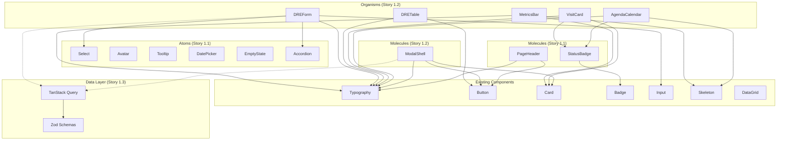

# Architecture — Component Architecture

**Epic:** EPIC-UI-01 — Design System Completion & Architecture Hardening

---

## Atomic Design Layer Definitions

Based on analysis of existing components (`src/components/`), the following layer boundaries are formalized:

### Atoms — Single-responsibility primitives with CVA variants, no business logic, no Supabase calls

| Atom | Story | Source Pattern | Notes |
|------|-------|---------------|-------|
| Select | 1.1 | Raw `<select>` in `AgendaAdmin.tsx:649-657`, `DREView.tsx:406-410` | CVA-styled, consistent with Input atom |
| Avatar | 1.1 | Inline avatar in `Layout.tsx` header | Image/initial fallback, size variants |
| Tooltip | 1.1 | CSS `group-hover` patterns | Accessible via `aria-describedby` |
| DatePicker | 1.1 | Native `<input type="date/time">` in AgendaAdmin, DREView | Wraps native date input with MX styling |
| EmptyState | 1.1 | Ad-hoc in `DataGrid.tsx:51-59`, `AgendaAdmin.tsx:427-435`, `DREView.tsx:234-239` | Icon + message + optional CTA |
| Accordion | 1.1 | Inline collapsible sections in `DREView.tsx:418-455` | Collapsible sections with header toggle |

### Molecules — Composed from 2+ atoms, may contain display logic, no Supabase calls

| Molecule | Story | Source Pattern | Notes |
|----------|-------|---------------|-------|
| PageHeader | 1.1 | Repeated across all 39 pages: title bar + subtitle + action buttons | Extract from `AgendaAdmin.tsx:230-272` pattern |
| ModalShell | 1.2 | Raw div overlay in `AgendaAdmin.tsx:628-765`, `DREView.tsx:394-495` | Wraps `@radix-ui/react-dialog` with `useFocusTrap` |
| StatusBadge | 1.2 | `getVisitStatusBadge()` in `AgendaAdmin.tsx:47-55` | Status-to-variant mapping with dot indicator |

### Organisms — Complex composed components with internal state, may consume hooks

| Organism | Story | Source Pattern | LOC Saved |
|----------|-------|---------------|-----------|
| AgendaCalendar | 1.2 | `AgendaAdmin.tsx:332-412` (80 LOC) — month grid, day cells, visit dots | ~80 LOC |
| VisitCard | 1.2 | `AgendaAdmin.tsx:460-547` (87 LOC) — visit row with status, actions, link | ~87 LOC |
| DRETable | 1.2 | `DREView.tsx:312-392` (80 LOC) — annual 12-month DRE table | ~80 LOC |
| DREForm | 1.2 | `DREView.tsx:394-495` (101 LOC) — modal form with 6 sections | ~101 LOC |
| MetricsBar | 1.2 | `AgendaAdmin.tsx:240-261` — metric cards grid | ~20 LOC |

---

## Component Interaction Diagram



---

## File Organization

New files to be added (existing structure unchanged):

```
src/
├── components/
│   ├── atoms/
│   │   ├── Select.tsx              # Story 1.1
│   │   ├── Select.test.ts          # Story 1.1
│   │   ├── Avatar.tsx              # Story 1.1
│   │   ├── Avatar.test.ts          # Story 1.1
│   │   ├── Tooltip.tsx             # Story 1.1
│   │   ├── DatePicker.tsx          # Story 1.1
│   │   ├── EmptyState.tsx          # Story 1.1
│   │   ├── EmptyState.test.ts      # Story 1.1
│   │   └── Accordion.tsx           # Story 1.1
│   ├── molecules/
│   │   ├── PageHeader.tsx          # Story 1.1
│   │   ├── PageHeader.test.ts      # Story 1.1
│   │   ├── ModalShell.tsx          # Story 1.2
│   │   ├── ModalShell.test.ts      # Story 1.2
│   │   └── StatusBadge.tsx         # Story 1.2
│   └── organisms/
│       ├── AgendaCalendar.tsx      # Story 1.2
│       ├── AgendaCalendar.test.ts  # Story 1.2
│       ├── VisitCard.tsx           # Story 1.2
│       ├── VisitCard.test.ts       # Story 1.2
│       ├── DRETable.tsx            # Story 1.2
│       ├── DREForm.tsx             # Story 1.2
│       ├── MetricsBar.tsx          # Story 1.2
│       └── DataGrid.tsx            # EXISTING — unchanged
├── hooks/
│   ├── useData.ts                  # DEPRECATED across stories, split into:
│   ├── useTrainings.ts             # Story 1.3 (extracted from useData.ts:9-54)
│   ├── useFeedbacks.ts             # Story 1.3 (extracted from useData.ts:57-134)
│   ├── usePDIs.ts                  # Story 1.3 (extracted from useData.ts:136-252)
│   ├── useFeedbackReports.ts       # Story 1.3 (extracted from useData.ts:153-176)
│   ├── useNotifications.ts         # Story 1.3 (extracted from useData.ts:255-338)
│   ├── useBroadcasts.ts            # Story 1.3 (extracted from useData.ts:341-373)
│   ├── useTeamTrainings.ts         # Story 1.3 (extracted from useData.ts:376-425)
│   └── useDeliveryRules.ts         # Story 1.3 (extracted from useData.ts:428-458)
├── lib/
│   ├── supabase.ts                 # UNCHANGED
│   ├── queryClient.ts              # Story 1.3 (TanStack Query client setup)
│   └── schemas/                    # Story 1.4
│       ├── training.schema.ts      # Zod schema for Training + TrainingProgress
│       ├── feedback.schema.ts      # Zod schema for Feedback + FeedbackFormData
│       ├── pdi.schema.ts           # Zod schema for PDI + PDIReview
│       ├── notification.schema.ts  # Zod schema for Notification
│       ├── consulting-client.schema.ts # Zod schema for ConsultingClient + detail
│       ├── dre.schema.ts           # Zod schema for DREFinancial
│       └── index.ts                # Re-exports
└── App.tsx                         # MODIFY: add QueryClientProvider wrapper
```

---

## Integration Guidelines

- **File Naming:** PascalCase for components (matching existing `Button.tsx`, `Card.tsx`), camelCase for hooks (matching existing `useData.ts`, `useDRE.ts`), camelCase for schemas
- **Folder Organization:** New atoms/molecules/organisms in existing `src/components/` hierarchy; new schemas in `src/lib/schemas/`; domain hooks replace `useData.ts` contents
- **Import/Export Patterns:** Named exports (matching existing pattern: `export function useTrainings()`, `export const DataGrid = memo(...)`); barrel re-exports from `lib/schemas/index.ts`

---

## Modal Standardization (TD-05, TD-06)

**Current State (2 inconsistent patterns):**

1. **AgendaAdmin.tsx:628-765** — Raw `div` overlay with `className="fixed inset-mx-0 bg-mx-black/60"`, no focus trap, no Radix
2. **DREView.tsx:394-495** — Raw `div` overlay with `useFocusTrap(modalRef, modalOpen)`, no Radix

**Target State — `<ModalShell>` molecule (Story 1.2):**

```tsx
interface ModalShellProps {
  open: boolean
  onOpenChange: (open: boolean) => void
  title: string
  description?: string
  icon?: React.ReactNode
  children: React.ReactNode
  size?: 'sm' | 'md' | 'lg' | 'xl'
  footer?: React.ReactNode
}
```

Wraps `@radix-ui/react-dialog` for:
- Proper `aria-modal`, `role="dialog"`, focus trap (built into Radix)
- Escape key handling (replaces manual `handleModalEscape` in `DREView.tsx:219`)
- Backdrop click to close
- Consistent visual styling: `bg-mx-black/60 backdrop-blur-md` overlay + white `Card` content

---

## Organism Extraction Targets

### AgendaAdmin Extraction (Story 1.2)

**Current:** `AgendaAdmin.tsx` — 768 LOC monolithic page

| Extracted Component | Lines | Responsibility |
|--------------------|-------|----------------|
| `<AgendaCalendar>` | 332-412 | Month grid, day cells, visit dot indicators, day selection |
| `<VisitCard>` | 460-547 | Individual visit row: date badge, client name, time, status, actions |
| `<MetricsBar>` | 240-261 | Metrics cards grid |
| `<ModalShell>` | 628-765 | Schedule visit form (reused from molecule) |
| Remaining page | ~350 | Header, filters, metrics, data orchestration, layout |

### DREView Extraction (Story 1.2)

**Current:** `DREView.tsx` — 500 LOC feature component

| Extracted Component | Lines | Responsibility |
|--------------------|-------|----------------|
| `<DRETable>` | 312-392 | Annual 12-month DRE spreadsheet with row rendering |
| `<DREForm>` | 394-495 | Modal form with 6 collapsible sections + computed preview |
| Remaining component | ~200 | Summary cards, header, data orchestration |

---

## Component Dependency Map

```
Atoms (New)
├── Select ──────── depends on: cn, Lucide ChevronDown
├── Avatar ──────── depends on: cn
├── Tooltip ──────── depends on: cn
├── DatePicker ──── depends on: Input
├── Accordion ──── depends on: cn, motion, Lucide ChevronDown
└── EmptyState ──── depends on: Typography, Button

Molecules (New)
├── PageHeader ──── depends on: Typography, Breadcrumb
├── StatusBadge ──── depends on: Badge
└── ModalShell ──── depends on: @radix-ui/react-dialog, Typography, cn, motion

Organisms (New)
├── AgendaCalendar ── depends on: Card, Typography, cn
├── VisitCard ────── depends on: Card, Typography, StatusBadge, Badge, Button
├── DRETable ──────── depends on: cn, Typography
├── DREForm ──────── depends on: ModalShell, Input
└── MetricsBar ────── depends on: Card, Typography, Skeleton
```

---

## Cross-References

- **Architecture Overview:** See `docs/architecture/00-overview.md`
- **Data Layer:** See `docs/architecture/02-data-layer.md`
- **Migration Strategy:** See `docs/architecture/03-migration.md`
- **Story 1.1 (Atoms & Molecules):** See `docs/prd/02-story-1.1.md`
- **Story 1.2 (Organisms):** See `docs/prd/03-story-1.2.md`
- **Front-End Spec:** See `docs/front-end-spec.md` Sections 4.1-4.3
