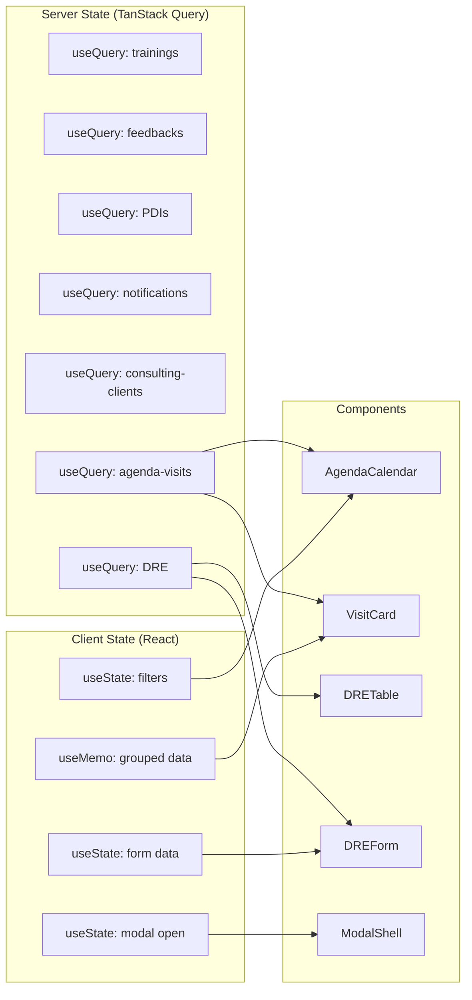

# Architecture — Data Layer Architecture

**Epic:** EPIC-UI-01 — Design System Completion & Architecture Hardening

---

## TanStack Query Setup

### Provider Installation — App.tsx modification (Story 1.3)

```tsx
import { QueryClient, QueryClientProvider } from '@tanstack/react-query'

const queryClient = new QueryClient({
  defaultOptions: {
    queries: {
      staleTime: 5 * 60 * 1000,     // 5 minutes
      gcTime: 10 * 60 * 1000,        // 10 minutes (formerly cacheTime)
      retry: 2,
      refetchOnWindowFocus: false,
    },
  },
})
```

Wrapping hierarchy: `QueryClientProvider` → `AuthProvider` → `ErrorBoundary` → `Router`

### Vite Chunk Update — `vite.config.ts:19-26`

```ts
'vendor-query': ['@tanstack/react-query'],
```

---

## Hook Decomposition Plan (TD-04, TD-07)

**Current State:** `useData.ts` (458 LOC) contains 7 unrelated hooks. Each follows the identical `useState+useCallback+useEffect` pattern.

**Target State:** One file per domain hook, each using TanStack Query's `useQuery`/`useMutation`.

| Hook | Current Location | Target File | Query Key Pattern | Migration Complexity |
|------|-----------------|-------------|-------------------|---------------------|
| `useTrainings` | `useData.ts:9-54` | `hooks/useTrainings.ts` | `['trainings', role]` | Low |
| `useFeedbacks` | `useData.ts:57-134` | `hooks/useFeedbacks.ts` | `['feedbacks', storeId, filters]` | Medium (role-based query builder) |
| `useMyPDIs` | `useData.ts:136-151` | Merged into `usePDIs` | `['pdis', profileId]` | Low |
| `useWeeklyFeedbackReports` | `useData.ts:153-176` | `hooks/useFeedbackReports.ts` | `['feedback-reports', storeId]` | Low |
| `usePDIs` | `useData.ts:179-252` | `hooks/usePDIs.ts` | `['pdis', storeId, role]` | Medium (reviews sub-query) |
| `useNotifications` | `useData.ts:255-338` | `hooks/useNotifications.ts` | `['notifications', profileId]` | High (mutations + RPC) |
| `useSystemBroadcasts` | `useData.ts:341-373` | `hooks/useBroadcasts.ts` | `['broadcasts']` | Low |
| `useTeamTrainings` | `useData.ts:376-425` | `hooks/useTeamTrainings.ts` | `['team-trainings', storeId]` | High (3 parallel queries + computation) |
| `useStoreDeliveryRules` | `useData.ts:428-458` | `hooks/useDeliveryRules.ts` | `['delivery-rules', storeId]` | Low |

### Hook Migration Pattern — Example (`useTrainings`)

```ts
// BEFORE (useData.ts:9-54) — manual pattern
export function useTrainings() {
  const { profile, role } = useAuth()
  const [trainings, setTrainings] = useState([])
  const [loading, setLoading] = useState(true)
  const [error, setError] = useState(null)
  const fetchTrainings = useCallback(async () => { /* ... */ }, [profile, role])
  useEffect(() => { fetchTrainings() }, [fetchTrainings])
  return { trainings, loading, error, refetch: fetchTrainings }
}

// AFTER (hooks/useTrainings.ts) — TanStack Query pattern
export function useTrainings() {
  const { profile, role } = useAuth()
  return useQuery({
    queryKey: ['trainings', role],
    queryFn: () => fetchTrainings(profile!.id, role!),
    enabled: !!profile,
  })
}

export function useMarkWatched() {
  const qc = useQueryClient()
  return useMutation({
    mutationFn: (trainingId: string) => markWatched(trainingId),
    onSuccess: () => qc.invalidateQueries({ queryKey: ['trainings'] }),
  })
}
```

### Existing domain hooks that remain unchanged

- `useDRE.ts` — Already well-structured (132 LOC), will be wrapped by TanStack Query in Story 1.3
- `useConsultingClients.ts` — Already well-structured (345 LOC), will be wrapped in Story 1.3
- `useAgendaAdmin.ts` — Already well-structured, will be wrapped in Story 1.3
- `useFocusTrap.ts` — Pure utility hook, no data fetching, unchanged
- `useAuth.tsx` — Context provider, wraps Supabase Auth — unchanged (not server state)

---

## State Management Architecture

### Server State vs Client State

**Server State** (TanStack Query — Story 1.3):
- All Supabase query results (trainings, feedbacks, PDIs, notifications, clients, visits, DRE, etc.)
- Managed via `useQuery` / `useMutation` with automatic cache, deduplication, and background refetch
- Query keys follow domain pattern: `['trainings', role]`, `['feedbacks', storeId, filters]`

**Client State** (React `useState` — unchanged):
- Form state (e.g., `scheduleForm` in `AgendaAdmin.tsx:95-104`)
- UI toggle state (e.g., modal open/close, collapsed sections)
- Filter selections (e.g., `dateFilter`, `statusFilter`)
- Computed derived state (e.g., `groupedVisits` via `useMemo`)

### State Flow Diagram



### Mutation & Cache Invalidation Strategy

All mutations use TanStack Query's `useMutation` with `onSuccess` invalidation:

```ts
export function useCreateVisit() {
  const qc = useQueryClient()
  return useMutation({
    mutationFn: (input: CreateVisitInput) => createVisitSupabase(input),
    onSuccess: () => {
      qc.invalidateQueries({ queryKey: ['agenda-visits'] })
    },
  })
}
```

This replaces the current pattern where each mutation manually calls `await fetchXxx()` to refresh data (seen in `useData.ts:41-43`, `useData.ts:123`, `useData.ts:226`, etc.).

---

## Zod Schema Boundaries (TD-02)

**Strategy:** Zod schemas validate data at **hook output boundaries** — after Supabase returns raw JSON, before components consume it. This catches API contract drift without changing Supabase queries.

| Schema | File | Validates | Used By |
|--------|------|-----------|---------|
| `TrainingSchema` | `lib/schemas/training.schema.ts` | `trainings` + `training_progress` rows | `useTrainings` |
| `FeedbackSchema` | `lib/schemas/feedback.schema.ts` | `feedbacks` rows + join aliases | `useFeedbacks` |
| `PDISchema` | `lib/schemas/pdi.schema.ts` | `pdis` + `pdi_reviews` rows | `usePDIs` |
| `NotificationSchema` | `lib/schemas/notification.schema.ts` | `notifications` rows | `useNotifications` |
| `ConsultingClientSchema` | `lib/schemas/consulting-client.schema.ts` | `consulting_clients` + detail aggregates | `useConsultingClients` |
| `DREFinancialSchema` | `lib/schemas/dre.schema.ts` | `consulting_financials` rows (~40 fields) | `useDRE` |

### Schema Pattern

```ts
import { z } from 'zod'

export const TrainingSchema = z.object({
  id: z.string().uuid(),
  title: z.string(),
  description: z.string().nullable(),
  type: z.string().nullable(),
  video_url: z.string().url().nullable(),
  target_audience: z.enum(['todos', 'vendedor', 'gerente', 'admin']),
  active: z.boolean(),
  created_at: z.string(),
})

export const TrainingArraySchema = z.array(TrainingSchema)

// In hook:
const result = TrainingArraySchema.safeParse(data)
if (!result.success) {
  console.error('[useTrainings] Schema validation failed:', result.error)
  throw new Error('Invalid training data from server')
}
return result.data
```

### Validation Utility (`src/lib/validate.ts`)

- `validateForm<T>(schema, data)` — returns `{ success: true, data: T } | { success: false, errors: Record<string, string> }`
- Field-level error messages in Portuguese
- Toast integration helper: `showValidationErrors(errors)` using sonner

---

## Hook Dependency Graph

```
useAuth (context provider)
  ├── useTrainings (Story 1.3)
  ├── useFeedbacks (Story 1.3)
  ├── usePDIs (Story 1.3)
  ├── useNotifications (Story 1.3)
  ├── useTeamTrainings (Story 1.3)
  ├── useDeliveryRules (Story 1.3)
  ├── useConsultingClients (existing)
  ├── useConsultingClientDetail (existing)
  ├── useDRE (existing)
  ├── useAgendaAdmin (existing)
  ├── useTeam (existing)
  ├── useStoreSales (existing)
  ├── useGoals (existing)
  ├── useRanking (existing)
  ├── useCheckins (existing)
  ├── useSellerMetrics (existing)
  └── useNetworkHierarchy (existing)
```

---

## Cross-References

- **Architecture Overview:** See `docs/architecture/00-overview.md`
- **Component Architecture:** See `docs/architecture/01-component-arch.md`
- **Migration Strategy:** See `docs/architecture/03-migration.md`
- **Story 1.3 (TanStack Query):** See `docs/prd/04-story-1.3.md`
- **Story 1.4 (Zod):** See `docs/prd/05-story-1.4.md`
