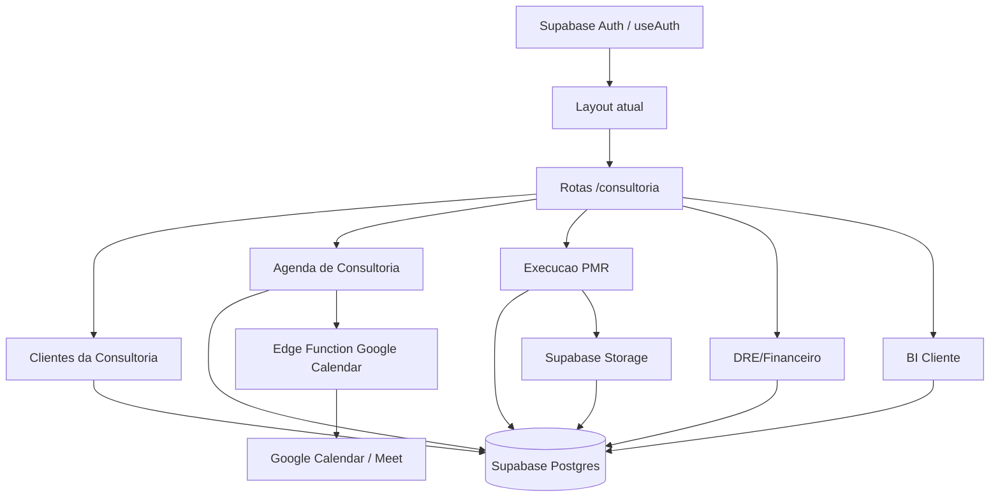

# Arquitetura Brownfield - CRM de Consultoria MX

Status: rascunho para validacao
Data: 2026-04-13
PRD: `docs/prd/mx-consultoria-crm-prd.md`
Impacto: `docs/architecture/mx-consultoria-crm-brownfield-impact.md`

## 1. Introducao

Este documento define a arquitetura para adicionar o CRM de Consultoria MX ao sistema existente `MX PERFORMANCE`, mantendo compatibilidade com o core atual de performance comercial.

Relacao com a arquitetura existente:

- O sistema atual continua sendo a base de autenticacao, UI, Supabase, PDI, treinamentos, check-ins e relatorios.
- O novo modulo entra como um bounded context de `consultoria`.
- Onde houver conflito com o PRD antigo, este documento orienta a implementacao do novo escopo sem sobrescrever os fluxos atuais.

## 2. Analise do projeto existente

Estado atual:

- Proposito principal: gestao de performance comercial diaria em lojas automotivas.
- Stack: React 19, Vite 6, TypeScript 5.8, Supabase JS, Supabase Postgres/RLS/Edge Functions, Tailwind CSS, Radix UI, Recharts.
- Arquitetura: frontend por paginas, hooks de dominio, componentes compartilhados, tipos canonicos e Supabase como backend.
- Deploy: Vercel para app Vite; Supabase para banco, auth e functions.

Documentacao disponivel:

- `README.md`
- `PRD_MX_PERFORMANCE_90D.md`
- `docs/architecture/system-architecture.md`
- `docs/prd/mx-consultoria-crm-analysis.md`
- `docs/architecture/mx-consultoria-crm-brownfield-impact.md`
- `docs/prd/mx-consultoria-crm-prd.md`
- `supabase/docs/SCHEMA.md`
- `supabase/docs/DB-AUDIT.md`

Restricoes:

- Nao quebrar rotas e tabelas do core de performance.
- Nao reaproveitar `/legacy/financeiro` ou `/legacy/inventory` como base canonica.
- RLS precisa existir antes de expor dados financeiros, documentos e clientes.
- Importacoes devem passar por validacao.
- Integracao Google Calendar/Meet nao deve expor segredos no frontend.

## 3. Estrategia de integracao

Tipo de enhancement: major enhancement com novas tabelas, rotas, integracao externa, importadores e UI.

Impacto: alto, mas isolavel se for implementado como contexto novo.

Estrategia:

- Criar prefixo conceitual `consulting_*` no banco.
- Criar pasta `src/features/consultoria`.
- Criar paginas novas em `src/pages` ou subpasta equivalente, mantendo padrao atual de lazy routes.
- Reaproveitar `useAuth`, `Layout`, UI base e padroes de hooks.
- Integrar com `pdis` e `trainings` apenas por tabelas de ponte quando necessario.
- Nao alterar sem necessidade as tabelas `stores`, `daily_checkins`, `devolutivas`, `pdis` e `trainings`.

Compatibilidade:

- API existente: sem alteracao obrigatoria.
- Banco existente: somente novas tabelas e indices em primeira fase.
- UI: novas rotas dentro do shell autenticado.
- Performance: listagens paginadas/filtradas para clientes, eventos e documentos.

## 4. Stack alinhada

| Categoria | Tecnologia atual | Uso no enhancement | Observacao |
| --- | --- | --- | --- |
| Frontend | React 19 | Novas telas e fluxos | Manter componentes funcionais e hooks |
| Build | Vite 6 | Build existente | Sem mudanca |
| Linguagem | TypeScript 5.8 | Tipos de consultoria | Atualizar tipos canonicos ou gerar tipos |
| Banco | Supabase Postgres | Novas tabelas `consulting_*` | RLS obrigatoria |
| Auth | Supabase Auth | Permissoes por papel | Reaproveitar `useAuth` |
| Functions | Supabase Edge Functions | Google Calendar, importacoes sensiveis | Segredos no backend |
| UI | Tailwind/Radix | Novas telas | Reaproveitar design system |
| Graficos | Recharts | BI de consultoria | Reaproveitar |

Nova tecnologia prevista:

| Tecnologia | Proposito | Racional | Integracao |
| --- | --- | --- | --- |
| Google Calendar API | Sync de visitas, aulas e eventos | Requisito direto dos arquivos e da ligacao | Edge Function com logs |
| Supabase Storage | Anexos/evidencias/documentos | Necessario para evidencias e relatorios | Storage + metadados + RLS/policies |

## 5. Modelos de dados

### 5.1 `consulting_clients`

Proposito: representar clientes da MX Consultoria.

Atributos principais:

- `id uuid primary key`
- `name text not null`
- `legal_name text`
- `cnpj text`
- `status text`
- `product_id uuid`
- `primary_store_id uuid null`
- `created_at timestamptz`
- `updated_at timestamptz`

Relacoes:

- Pode se relacionar com `stores` quando o cliente tambem for loja operacional do core.
- Relaciona com unidades, contatos, visitas, documentos, financeiro, estoque e leads.

### 5.2 `atribuicoes_consultoria`

Proposito: registrar consultores responsaveis/auxiliares por cliente.

Atributos:

- `id uuid primary key`
- `client_id uuid not null`
- `user_id uuid not null`
- `role text not null` - `responsavel`, `auxiliar`, `viewer`
- `active boolean not null default true`

Relacoes:

- `user_id` aponta para usuario existente.
- Ajuda a RLS de consultores.

### 5.3 `consulting_calendar_events`

Proposito: agenda de visitas, aulas, eventos e bloqueios.

Atributos:

- `id uuid primary key`
- `client_id uuid null`
- `event_type text not null` - visita, aula, evento_online, evento_presencial, bloqueio
- `visit_number int null`
- `title text`
- `starts_at timestamptz`
- `ends_at timestamptz`
- `mode text`
- `responsible_consultant_id uuid`
- `assistant_consultant_id uuid`
- `google_event_id text`
- `google_calendar_id text`
- `google_meet_url text`
- `sync_status text`
- `sync_error text`

### 5.4 `pmr_visit_templates` e `pmr_visit_template_steps`

Proposito: guardar objetivos/checklists oficiais do PMR.

Atributos de template:

- `id uuid primary key`
- `visit_number int not null`
- `name text not null`
- `duration_minutes int`
- `target_audience text`
- `report_model text`
- `sales_moment text`

Atributos de etapa:

- `id uuid primary key`
- `template_id uuid not null`
- `position int not null`
- `description text not null`
- `evidence_required boolean`
- `evidence_type text`

### 5.5 `consulting_visits` e `consulting_visit_steps`

Proposito: execucao real de cada visita do cliente.

Atributos de visita:

- `id uuid primary key`
- `client_id uuid not null`
- `calendar_event_id uuid`
- `template_id uuid not null`
- `consultant_id uuid`
- `status text`
- `started_at timestamptz`
- `completed_at timestamptz`
- `summary text`

Atributos de etapa:

- `id uuid primary key`
- `visit_id uuid not null`
- `template_step_id uuid`
- `status text`
- `notes text`
- `completed_at timestamptz`

### 5.6 `consulting_documents`

Proposito: metadados de anexos, evidencias e relatorios.

Atributos:

- `id uuid primary key`
- `client_id uuid not null`
- `visit_id uuid null`
- `visit_step_id uuid null`
- `document_type text not null`
- `storage_path text not null`
- `source_filename text`
- `uploaded_by uuid`
- `created_at timestamptz`

### 5.7 Financeiro, estoque e leads

Tabelas:

- `consulting_financial_periods`
- `consulting_financial_lines`
- `consulting_financial_imports`
- `snapshots_estoque_consultoria`
- `itens_estoque_consultoria`
- `consulting_lead_imports`
- `consulting_lead_channel_metrics`

Estrategia:

- Importacoes criam um registro de lote.
- Linhas invalidas ficam marcadas no lote antes de gravacao final.
- Dashboards leem apenas dados aprovados.

## 6. Integracao de componentes



Novos componentes/pastas:

- `src/features/consultoria/clients`
- `src/features/consultoria/agenda`
- `src/features/consultoria/visits`
- `src/features/consultoria/documents`
- `src/features/consultoria/financials`
- `src/features/consultoria/inventory`
- `src/features/consultoria/leads`
- `src/features/consultoria/bi`

## 7. API e Edge Functions

O frontend pode continuar usando Supabase JS diretamente para CRUD simples, seguindo o padrao atual. Operacoes com segredo, integracoes externas ou importacoes sensiveis devem ir para Edge Functions.

Funcoes recomendadas:

- `consultoria-calendar-sync`
- `consultoria-import-agenda`
- `consultoria-import-financials`
- `consultoria-import-inventory`
- `consultoria-import-leads`
- `consultoria-generate-visit-report`

Autenticacao:

- Todas as funcoes exigem usuario autenticado.
- Funcoes validam papel/assignment no banco antes de operar.

## 8. Integracao externa - Google Calendar/Meet

Finalidade:

- Criar/atualizar/excluir eventos de visita.
- Gerar/armazenar Meet quando aplicavel.
- Atualizar evento ao trocar data, consultor ou numero da visita.
- Detectar duplicidades.

Campos obrigatorios:

- `google_event_id`
- `google_calendar_id`
- `sync_status`
- `sync_error`
- `last_synced_at`

Tratamento de erro:

- Falha de sync nao deve apagar evento local.
- UI deve exibir pendencia de sync.
- Operacao manual deve permitir retry.

## 9. Organizacao de arquivos

```plaintext
src/
  features/
    consultoria/
      clients/
      agenda/
      visits/
      documents/
      financials/
      inventory/
      leads/
      bi/
  hooks/
    useConsultingClients.ts
    useConsultingAgenda.ts
    useConsultingVisits.ts
    useConsultingDocuments.ts
    useConsultingFinancials.ts
    useConsultingInventory.ts
    useConsultingLeadMetrics.ts
  pages/
    Consultoria.tsx
    ConsultoriaClientes.tsx
    ConsultoriaClienteDetalhe.tsx
    ConsultoriaAgenda.tsx
    ConsultoriaVisita.tsx
    ConsultoriaImportacoes.tsx
    ConsultoriaFinanceiro.tsx
    ConsultoriaEstoque.tsx
    ConsultoriaBI.tsx
supabase/
  migrations/
    <timestamp>_consulting_core.sql
    <timestamp>_consulting_calendar.sql
    <timestamp>_consulting_visits_documents.sql
    <timestamp>_consulting_financial_inventory_leads.sql
  functions/
    consultoria-calendar-sync/
    consultoria-import-agenda/
    consultoria-import-financials/
    consultoria-import-inventory/
    consultoria-import-leads/
```

## 10. Deploy e rollback

Deploy:

- Usar pipeline existente Vercel + Supabase migrations/functions.
- Liberar por etapas: schema primeiro, depois UI, depois integracoes externas.

Rollback:

- Tabelas novas isoladas permitem desabilitar rotas sem tocar core.
- Variavel/feature flag pode esconder `/consultoria` enquanto dados estabilizam.
- Sync Google deve ser idempotente para evitar duplicidade em rollback/retry.

Padrao por story:

- Story de schema deve ter migration isolada e teste RLS.
- Story de UI deve ter rota nova protegida e reversivel sem mexer em rotas existentes.
- Story de importacao deve gravar primeiro em staging.
- Story de Google deve ficar atras de configuracao explicita e logs de retry.
- Story de financeiro/documentos deve falhar fechada quando permissao ou policy estiver ausente.

Monitoramento:

- Logs em `consulting_calendar_sync_logs`.
- Logs de importacao por lote.
- Audit log para financeiro/documentos.

## 11. Padroes de codigo

- Manter TypeScript.
- Manter hooks por dominio.
- Manter rotas lazy em `src/App.tsx`.
- Manter componentes compartilhados de `src/components`.
- Evitar adicionar novo design system.
- Evitar escrever logica de importacao pesada dentro de componente React.
- Colocar validadores e mapeadores em `src/features/consultoria/*` ou em scripts/functions dedicados.

## 12. Testes

Testes obrigatorios:

- Unitarios para validadores de importacao.
- Unitarios para mapeamento de visita/template.
- Testes de RLS para cliente, documento e financeiro.
- Testes de hooks principais.
- E2E do fluxo: criar cliente -> importar agenda/objetivo -> abrir visita -> preencher checklist -> anexar evidencia -> consultar historico.
- Regressao: check-in, ranking, funil, feedback, PDI, treinamentos e relatorios atuais.

Comandos de qualidade:

- `npm run lint`
- `npm run typecheck`
- `npm test`
- `npm run build`

## 13. Seguranca

Autenticacao:

- Supabase Auth existente.

Autorizacao:

- Admin/MX ve tudo.
- Consultor ve apenas clientes vinculados, salvo regra futura de master consultor.
- Cliente/loja, se houver portal, ve apenas seu proprio contexto.

Protecao de dados:

- RLS obrigatoria em todas as tabelas `consulting_*`.
- Storage com policies alinhadas ao metadado do documento.
- Dados financeiros e documentos sempre com checagem de cliente/assignment.

Google:

- Tokens/segredos fora do frontend.
- Logs sem expor tokens.

## 14. Checklist de arquitetura

- [x] Escopo exige arquitetura, nao apenas story isolada.
- [x] Conflito com PRD atual identificado.
- [x] Contexto novo recomendado para preservar core.
- [x] RLS identificado como pre-condicao.
- [x] Importacao com staging/validacao definida.
- [x] Google Calendar/Meet isolado em backend.
- [x] Rotas e estrutura de arquivos propostas.
- [x] Testes e regressao definidos.

## 15. Handoff para SM

Use este documento junto com `docs/prd/mx-consultoria-crm-prd.md`. A primeira story deve criar a fundacao do contexto `consultoria`: schema base, RLS e tipos/hook minimo para clientes da consultoria. Cada story deve incluir verificacao de regressao do core atual.

## 16. Handoff para Dev

Nao implemente financeiro, Google Calendar ou BI antes da fundacao de banco e RLS. Comece por tabelas isoladas `consulting_*`, testes de RLS e tela minima de clientes. Preserve `stores`, `daily_checkins`, `devolutivas`, `pdis`, `trainings` e relatorios atuais.
