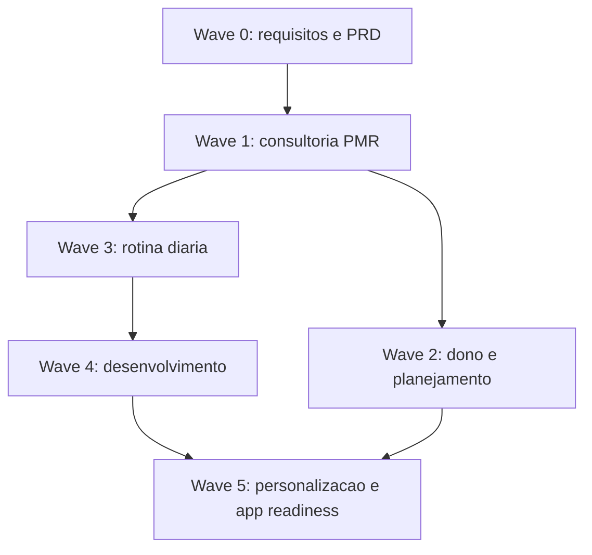

# Dependency Matrix - EPIC-MX-CONS-DEV-20260515

**Status:** Draft operacional  
**Orquestrador:** @aiox-master  
**Regra:** executar em ondas, com @po aprovando transicao e @qa validando regressao quando houver codigo.

## Sequencia Recomendada

## Dependencias por Story

| Story | Depende de | Motivo |
|---|---|---|
| CONS-13 | Wave 0 | Visita 8 precisa de decisao PMR 1-7 + acompanhamento mensal. |
| CONS-14 | CONS-13 parcial | Fluxo sequencial deve saber se visita 8 aparece no fluxo principal ou como acompanhamento. |
| CONS-15 | CONS-14 parcial | Periodo de analise precisa aparecer no contexto da visita. |
| CONS-16 | CONS-15 | Relatorio precisa refletir periodo e secoes padrao. |
| CONS-17 | Wave 0 | Recorte de indicadores precisa de aprovacao PM/PO. |
| CONS-18 | CONS-17 | Planejado x realizado depende do recorte aprovado e fontes de dados. |
| CONS-19 | CONS-18 parcial | Visao do dono depende do modelo de indicadores. |
| OPS-20 | Wave 0 | Campos diarios precisam ser congelados antes de UX mobile. |
| OPS-21 | OPS-20 | Gerente valida o que vendedor preenche. |
| OPS-22 | OPS-20 | Notificacao depende de pendencia definida. |
| OPS-23 | OPS-20, OPS-21 | Disciplina depende de dados preenchidos e validacao. |
| DEV-24 | Wave 3 parcial | Reposicionamento deve conhecer rotina e desenvolvimento esperado do vendedor. |
| DEV-25 | DEV-24 | Biblioteca precisa da arquitetura de informacao da area. |
| DEV-26 | DEV-25 | Trilha precisa de conteudos catalogados. |
| DEV-27 | DEV-25, stories PDI/feedback existentes | Recomendacao depende de conteudos e lacunas registradas. |
| APP-28 | DEV-26 | Conteudo institucional entra como extensao da trilha. |
| APP-29 | DEV-25 | Curadoria depende da biblioteca. |
| APP-30 | Waves 1, 3, 4 | App readiness valida fluxos principais ja definidos. |
| APP-31 | APP-30 | Checklist de submissao depende de readiness tecnico e QA. |

## Dependencias Tecnicas Criticas

| Area | Dependencia | Agente gate |
|---|---|---|
| RLS consultoria | Visita, relatorio e dono nao podem vazar dados entre lojas/clientes. | @data-engineer + @qa |
| PMR 1-7 | Visita 8 nao deve quebrar ciclo principal, progresso e conclusao legada. | @architect + @qa |
| Indicadores | Planejado x realizado nao pode exibir dado ausente como zero real. | @data-engineer + @po |
| Mobile vendedor | Check-in, notificacao e desenvolvimento precisam caber no uso diario em celular. | @ux-design-expert + @qa |
| PDI/feedback | Dados sensiveis de vendedor nao podem aparecer para outro vendedor. | @data-engineer + @qa |
| Conteudo por loja | Conteudo institucional deve respeitar multi-tenant. | @data-engineer + @qa |
| App readiness | PWA/app nao deve ir para submissao sem matriz de roles testada. | @qa + @devops |

## Paralelismo Seguro

Pode rodar em paralelo:

- CONS-13 e CONS-17, apos Wave 0 aprovada.
- CONS-14 e OPS-20, se @ux-design-expert controlar consistencia mobile.
- CONS-18 e OPS-21, desde que nao alterem a mesma fonte de dados.
- DEV-24 e refinamento de APP-31 documental.

Nao rodar em paralelo sem alinhamento:

- DEV-25 e DEV-26, se ambos alterarem `useTrainings` ou schema de progresso.
- CONS-13 e qualquer ajuste amplo de `current_visit_step`.
- OPS-22 e DEV-26, se ambos criarem notificacoes novas.
- APP-28 e DEV-25, se schema de conteudo ainda nao estiver fechado.

## Ordem Minima para Primeira Entrega Demonstravel

1. CONS-13
2. CONS-14
3. CONS-15
4. CONS-16
5. OPS-20
6. OPS-21
7. DEV-24
8. DEV-25

Essa sequencia entrega consultoria utilizavel, input diario e base de desenvolvimento sem esperar app store.
