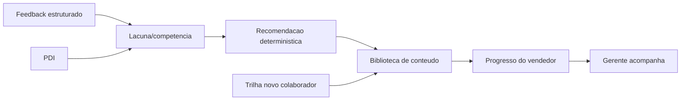

# Wave 4 Architecture Notes - Desenvolvimento de Pessoas

**Status:** Preflight tecnico preparado por @aiox-master  
**Destino:** @architect, @data-engineer, @ux-design-expert, @dev  
**Stories:** DEV-24, DEV-25, DEV-26, DEV-27

## Decisao de Corte

A Onda 4 deve evoluir o modulo atual de treinamentos, PDI e feedback. Nao criar um LMS paralelo. O objetivo e mudar a proposta de valor para "desenvolvimento de pessoas" e conectar conteudo, rotina, feedback e PDI.

## Reuso Obrigatorio

- `src/pages/VendedorTreinamentos.tsx`: experiencia atual do vendedor com busca, progresso e prescricoes.
- `src/pages/GerenteTreinamentos.tsx`: experiencia atual do gerente com equipe, matriz e lembretes.
- `src/pages/GerentePDI.tsx`: fluxo atual de PDI.
- `src/pages/GerenteFeedbacks.tsx`: fluxo atual de feedback/devolutiva.
- `src/hooks/useTrainings.ts`: fonte atual de conteudos e progresso.
- `src/hooks/usePDISessions.ts`: fonte atual de sessoes PDI.
- `docs/stories/story-pdi-complete-09/spec/spec.md`: contrato de PDI 2.0.
- `docs/stories/story-structured-feedback-08/spec/spec.md`: contrato de feedback estruturado.
- `docs/stories/story-training-notifications-12/spec/spec.md`: contrato de notificacoes de treinamento.

## Modelo Conceitual

## Contratos Recomendados

### Conteudo

Conteudo deve aceitar metadados de tema e publico-alvo sem quebrar conteudos existentes.

Campos candidatos:

- `theme text`
- `tags text[]`
- `target_audience text`
- `source_type text`
- `status text`

### Avaliacao

Avaliacoes devem ser por usuario e conteudo.

Campos candidatos:

- `training_id uuid`
- `user_id uuid`
- `rating smallint`
- `comment text null`
- `created_at timestamptz`

### Sugestao

Sugestoes devem virar backlog editorial, nao conteudo automatico.

Campos candidatos:

- `store_id uuid null`
- `user_id uuid`
- `theme text null`
- `suggestion text`
- `status text`

### Trilha

Trilha de novo colaborador deve ser atribuida a usuario, com etapas e status.

Campos candidatos:

- `trail_id uuid`
- `seller_user_id uuid`
- `assigned_by uuid`
- `status text`
- `started_at timestamptz`
- `completed_at timestamptz null`

## Regras de Integracao

- DEV-24 nao deve exigir migration se for apenas rotulo/navegacao.
- DEV-25 provavelmente exige metadados e tabelas de avaliacao/sugestao.
- DEV-26 deve depender da biblioteca minima de conteudos.
- DEV-27 deve usar mapeamento deterministico `lacuna -> tema -> conteudo`.
- IA para recomendacao fica fora do MVP.

## Riscos

- Rebatizar Treinamentos sem ajustar expectativas de gerente/vendedor pode confundir usuarios atuais.
- Criar trilha antes de catalogo minimo deixa o fluxo vazio.
- Permitir sugestoes sem status/editorial pode virar caixa operacional sem dono.
- PDI e feedback possuem dados sensiveis; vendedor nao pode acessar dados de outros vendedores.

## Gate Arquitetural

Antes de desenvolvimento:

- Confirmar nome final da area.
- Confirmar se metadados entram em tabela existente ou tabela complementar.
- Confirmar fonte unica de progresso.
- Confirmar se notificacao de conclusao da trilha reutiliza `notificacoes`.
- Confirmar matriz de permissoes por vendedor, gerente, dono, admin e admin master.
